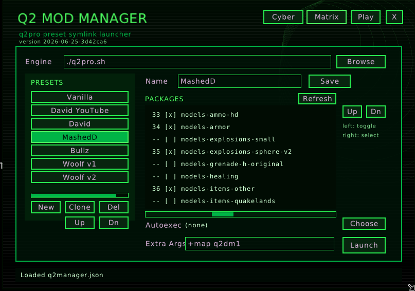

# q2manager

Small Quake II/q2pro mod preset launcher. UI is raylib + raygui.



## Features

- JSON settings in `q2manager.json` next to the q2manager executable
- Built-in file browser for engine, Quake II directory, packages, and cfg files
- Presets with ordered `.pak`/`.pkz` package list and ordered `.cfg` fragments
- Packages are selected from `<q2manager_exe_dir>/.q2manager/paks`
- Configs are selected from `<q2manager_exe_dir>/.q2manager/configs`
- Package/config paths inside the game folder are saved relative in JSON
- Per-launch symlinks are written into `<q2manager_exe_dir>/baseq2`
- Ordered package symlinks named `q2m_pak_00_name.pkz`, `q2m_pak_01_name.pak`, etc.
- Built-in procedural keygen-style background music with Play/Pause button, stopped by default
- Theme buttons: Cyber and Matrix neon-green
- Cyber-style app icon in `assets/icon.png`/`.ico`/`.svg`
- Direct q2pro launch on Linux and Windows

## Notes

- `.pkz` paks are .zip files in nature, easy to edit under Midnight Commander
- r1q2 doesn't handle `.pkz` files

## Build

```sh
cmake -S . -B build
cmake --build build --config Release
```

Windows with Visual Studio:

```powershell
cmake -S . -B build
cmake --build build --config Release
```

## Linux Desktop Entry

Use `q2manager.desktop.example` as a template. Replace `/ABSOLUTE/PATH/TO/QUAKE2` with your real Quake II directory, then copy it to:

```text
~/.local/share/applications/q2manager.desktop
```

`Exec` should point to the real q2manager executable inside the Quake II folder. Do not point it at a symlink, because q2manager uses its executable directory as the game directory.

## Use

1. Put q2manager executable in your Quake II directory.
2. Set `Engine` to `q2pro`/`q2pro.exe`; relative paths are resolved from q2manager executable directory.
3. Put selectable `.pak`/`.pkz` files in `<q2manager_exe_dir>/.q2manager/paks`.
4. Put selectable `.cfg` files in `<q2manager_exe_dir>/.q2manager/configs`.
5. Create or select preset.
6. Use `Packages` tab to activate/deactivate `.pak`/`.pkz` files.
7. Use `Configs` tab to activate/deactivate `.cfg` fragments.
8. Press `Launch`.

Launch creates symlinks in:

```text
<q2manager_exe_dir>/baseq2/
```

Package list order is encoded into symlink names with `q2m_pak_NN_` prefixes, so q2pro sees deterministic package ordering when scanning `baseq2`.

Package panel shows every `.pak`/`.pkz` from `.q2manager/paks`. Left-click a row to toggle it for the current preset. Active rows show their load order. Right-click an active row to select it, then use `Up`/`Dn` to reorder.

Configs panel shows every `.cfg` from `.q2manager/configs` recursively. Left-click a config to toggle it for the current preset. Active rows show exec order. Right-click a config to select it, then use `Up`/`Dn` to reorder if active.

Selected configs are symlinked into `baseq2` as `q2m_cfg_NN_name.cfg`. Generated `autoexec.cfg` only execs those local names because q2pro does not load `..` paths from `baseq2`.

If `<q2manager_exe_dir>/baseq2/autoexec.cfg` already exists and was not created by q2manager, it is renamed to a dated backup like `autoexec.cfg.2026-06-24` before q2manager writes generated autoexec. q2manager tracks its own generated autoexec with `<q2manager_exe_dir>/baseq2/.q2manager_autoexec`.

Then runs:

```text
q2pro +set basedir <q2manager_exe_dir> +set game baseq2 +exec autoexec.cfg
```

Windows symlink creation can require Developer Mode or elevated privileges.

## TODO

- add better chiptunes music or remove it
- optionally: mods handling
- optionally: server browser
- consider adding option to make configs/paks managing read-only
